# 🏙️ IntelliPolis: AI 기반 도시계획 의사결정 지원 플랫폼

> **Designing Smarter Cities with AI**  
> IntelliPolis는 도시계획 담당자와 지역 주민을 위해 인구, 교통, 환경, 공공시설, 예산 데이터를 분석하고, Spring AI 기반 멀티 에이전트가 다양한 관점의 도시계획 대안을 제안하는 웹 서비스입니다.

AI가 실제 행정 결정을 대신하는 것이 아니라, 다양한 계획안을 정량적 수치와 비교·검토할 수 있도록 객관적이고 직관적인 도구를 제공하는 것을 목표로 합니다.

---

## 📌 1. 프로젝트 핵심 아키텍처 및 역할 분담

IntelliPolis는 모든 의사결정을 생성형 AI에만 의존하지 않고, **검증된 Java 규칙 계산기**와 **Spring AI(Gemini)**의 상호보완적 결합으로 구동됩니다.

* **정확한 수치 및 정량적 계산:** **Java 백엔드**가 담당 (도시 점수 계산, 예산/좌표 유효성 검증, 데이터 누락 차단)
* **정성적 해석 및 아이디어 제안:** **Spring AI (Gemini 3.1 Flash-Lite)**가 담당 (도시 문제점 진단, 상충 관계 분석, 3대 시나리오 계획안 작성)

```text
  [사용자 입력] ──> [Java 백엔드: 정량 검증 및 도시 점수 산출]
                          │
                          └──> [Spring AI: 분석 설명 및 3대 계획안 수립]
                                    │
                                    └──> [React + MapLibre: 대시보드 및 지도 시각화]

```

## 👥 2. 팀원 및 역할 분담

| 이름 | 담당 역할 | 주요 업무 |
| --- | --- | --- |
| **정혁** | 팀장 · GitHub 관리 · 백엔드 개발 | GitHub Organization/Repository 관리, 브랜치 및 PR 병합 제어, Spring Boot 핵심 도메인 API 개발, 데이터 검증 및 도시 점수 계산 로직 구현 |
| **유서하** | 프론트엔드 개발 · Spring AI 관리 | React 주요 대시보드 화면 및 기능 개발, MapLibre GL JS 지도 시각화 연동, Spring AI 프롬프트 엔지니어링 및 구조화 출력 관리 |
| **이민재** | 프론트엔드 UI·UX · 디자인 | CSS 스타일링 및 반응형 레이아웃 설계, 지도 및 대시보드 컴포넌트 시각적 고도화, 발표용 데모 시나리오 최적화 및 화면 개선 |

---

## ⚙️ 3. 환경 변수 설정 (Environment Setup)

프로젝트를 실행하기 전, 로컬 환경에서 백엔드와 프론트엔드의 환경 변수(`.env`)를 반드시 먼저 설정해야 합니다.

### 📂 백엔드 설정 (`backend/.env`)

`backend` 디렉토리 하위에 `.env` 파일을 생성하고 아래 9가지 변수를 정확히 기입합니다.

*(주의: `SPRING_AI_MODEL_CHAT`이 `google-genai`로 활성화되어 있지 않으면 AI 모델이 호출되지 않고 항상 Fallback 템플릿만 동작하게 됩니다.)*

```env
# 1. Gemini AI 설정
GEMINI_API_KEY=your_actual_gemini_api_key_here
GEMINI_MODEL=gemini-3.1-flash-lite
SPRING_AI_MODEL_CHAT=google-genai

# 2. 서버 및 웹 오리진 설정
FRONTEND_ORIGIN=http://localhost:5173

# 3. 외부 공간정보 및 공공 API 키 설정
VWORLD_API_KEY=your_vworld_api_key_here
VWORLD_DOMAIN=http://localhost:5173
PUBLIC_DATA_API_KEY=your_public_portal_key_here
NEIS_API_KEY=your_neis_api_key_here
ITS_API_KEY=your_its_api_key_here

```

### 📂 프론트엔드 설정 (`frontend/.env`)

`frontend` 디렉토리 하위에 `.env` 파일을 생성하고 백엔드 엔드포인트를 매핑합니다.

```env
VITE_API_BASE_URL=http://localhost:8080
VITE_MAP_STYLE_URL=[https://demotiles.maplibre.org/style.json](https://demotiles.maplibre.org/style.json)
VITE_USE_MOCK=false

```

---

## 🚀 4. 로컬 구동 및 실행 (How to Run)

### ☕ 백엔드 (Spring Boot)

1. Java 21 및 Gradle 환경을 확인합니다.
2. `backend` 디렉토리로 이동하여 서버를 기동합니다.

```bash
cd backend

# Windows (PowerShell)
.\gradlew.bat bootRun

# macOS / Linux
./gradlew bootRun

```

* **서버 동작 확인:** 브라우저에서 `http://localhost:8080/api/health` 접속 시 `UP` 또는 `200 OK` 확인.

### ⚛️ 프론트엔드 (React)

1. Node.js (v18 이상 권장) 환경을 확인합니다.
2. `frontend` 디렉토리로 이동하여 의존성 패키지를 설치하고 개발 서버를 엽니다.

```bash
cd frontend
npm install
npm run dev

```

* **사용자 웹 접속:** 브라우저에서 `http://localhost:5173` 접속.

---

## 🧪 5. Bruno를 이용한 API 재현 및 시연 시나리오

본 프로젝트의 API 사양과 AI 장애 대응 복원력은 Bruno 컬렉션 파일을 임포트하여 즉시 원클릭으로 검증 및 시연이 가능합니다.

### 🔄 [시나리오 1] 핵심 분석 및 대안 수립 정상 프로세스 (Happy Path)

| 단계별 분석 흐름 및 설명 | 동작 스크린샷 (Screenshot) |
| :--- | :---: |
| **Step 1. 서비스 헬스 체크 및 샘플 조회**<br>• 백엔드 기동 상태를 점검하고 데모 시연을 위한 기본 도시 데이터를 로드합니다. | 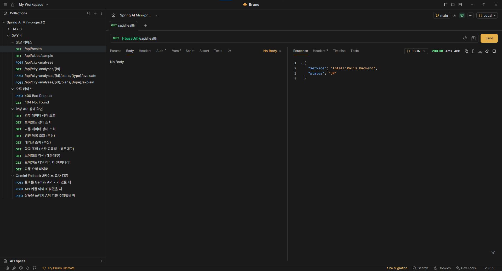 |
| **Step 2. 도시 분석 지표 입력 및 전송**<br>• 인구, 예산, 도로 등 15가지 정량 행정 데이터를 Form 인터페이스를 통해 입력합니다. | 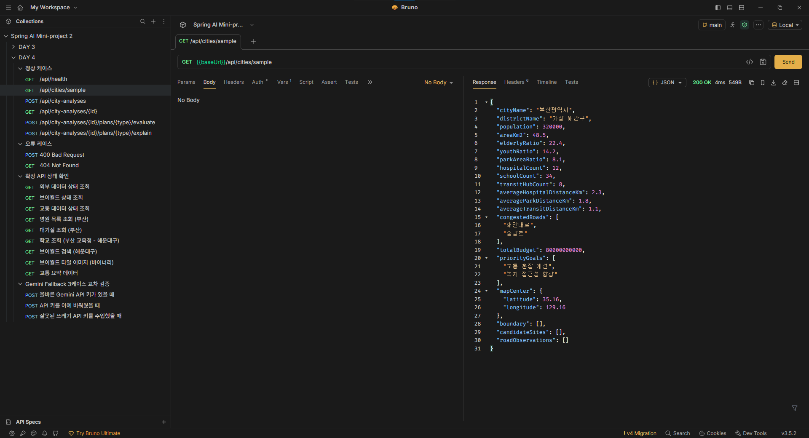 |
| **Step 3. 자치구 영역 지정 및 공간 분석**<br>• 지도 위에 대상 자치구 경계를 파싱하고, 분석을 위한 공간적 바운더리를 확정합니다. | 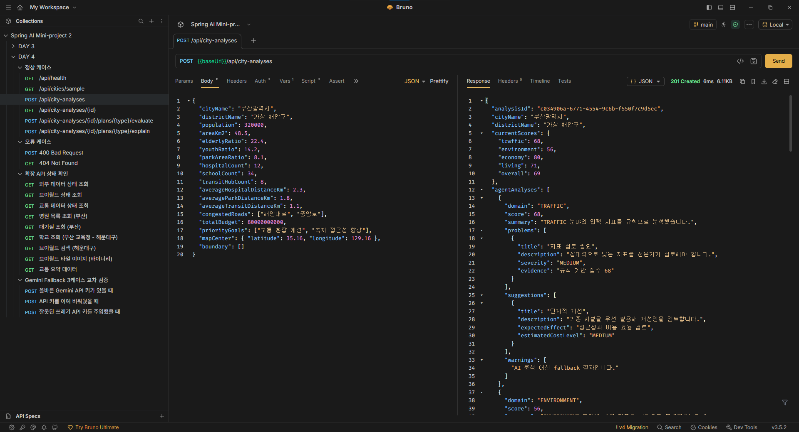 |
| **Step 4. Java 백엔드 정량 점수 산출**<br>• 백엔드가 분석 모델을 돌려 종합, 교통, 환경, 생활 점수를 규칙 기반으로 무결하게 계산합니다. | 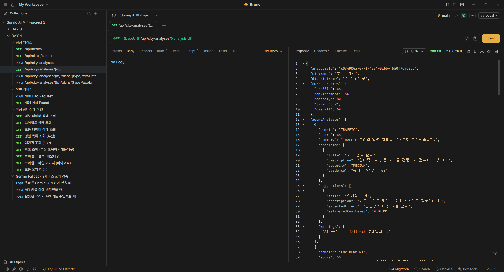 |
| **Step 5. Gemini AI 종합 진단 설명서 출력**<br>• 계산된 점수와 우선순위 목표를 바탕으로 실시간 텍스트 브리핑 요약본을 출력합니다. | 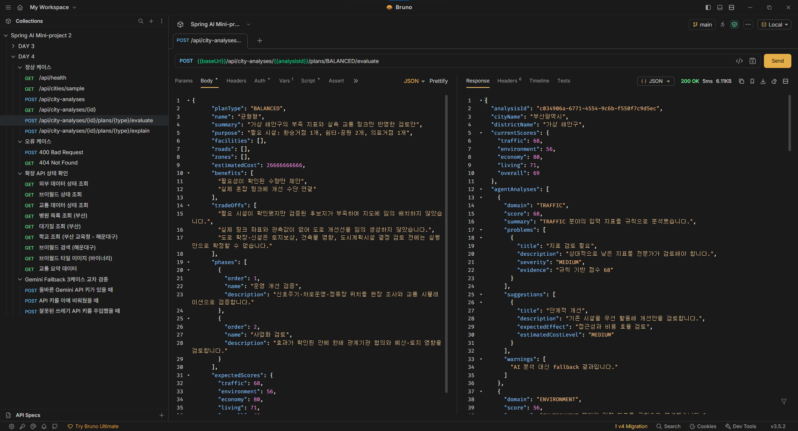 |
| **Step 6. 도시 주요 문제점(Insight) 분류**<br>• 시급성이 높은 도시 이슈(교통 체증, 인프라 불균형 등)를 위험 등급별로 세분화하여 리스트업합니다. | 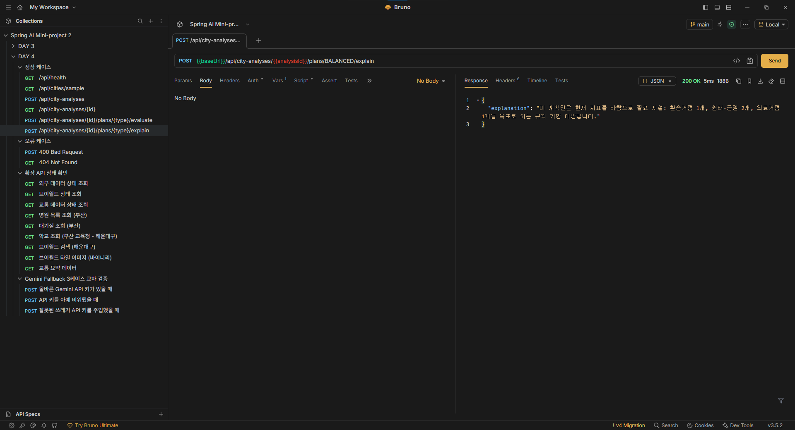 |

---

#### 📝 도시 분석 생성 요청 Payload 예시 (`POST /api/city-analyses`)

```json
{
  "cityName": "부산광역시",
  "districtName": "해운대구",
  "population": 320000,
  "areaKm2": 48.5,
  "elderlyRatio": 22.4,
  "youthRatio": 14.2,
  "parkAreaRatio": 8.1,
  "hospitalCount": 12,
  "schoolCount": 34,
  "transitHubCount": 8,
  "averageHospitalDistanceKm": 2.3,
  "averageParkDistanceKm": 1.8,
  "averageTransitDistanceKm": 1.1,
  "congestedRoads": ["해운대해변로", "센텀남대로"],
  "totalBudget": 80000000000,
  "priorityGoals": ["교통 혼잡 개선", "녹지 접근성 향상"],
  "mapCenter": {
    "latitude": 35.16,
    "longitude": 129.16
  },
  "boundary": []
}

```

---

### 🛡️ [시나리오 2] 예외 상황 및 Gemini AI 3-Way Fault Tolerance 검증

| 예외 상황 및 자가 복구 대응 설명 | 동작 스크린샷 (Screenshot) |
| :--- | :---: |
| **A. 잘못된 요청값 필터링 (400 Bad Request)**<br>• 필수 파라미터가 누락되거나 유효하지 않은 값(음수 등)이 인입되었을 때 내부 서버 에러(500)를 발생시키지 않고 사전에 올바른 에러 사유를 포착하여 대응합니다. | 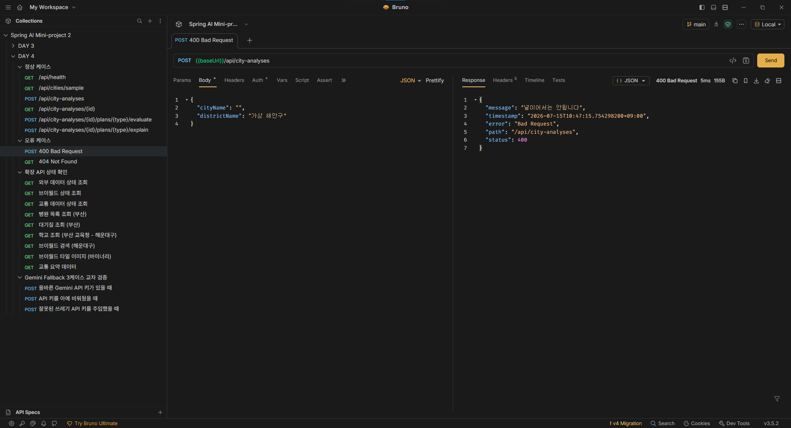 |
| **B. 데이터 미존재 대응 (404 Not Found)**<br>• 존재하지 않는 UUID 분석 데이터의 단건 조회를 시도했을 때, 글로벌 예외 처리를 통해 클라이언트에게 안전한 오류 응답을 전달합니다. | 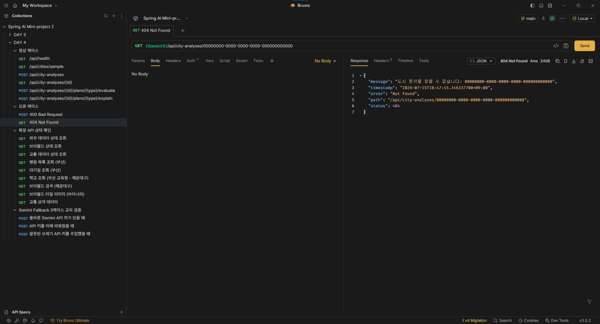 |
| **C-1. [3-Way] 정상 모드 (Normal Mode)**<br>• `.env`에 정상적인 Gemini API Key가 로드된 상태로, 실시간 생성된 고품질 AI 문맥과 정성적 제안 사항을 수신합니다. (200 OK) | 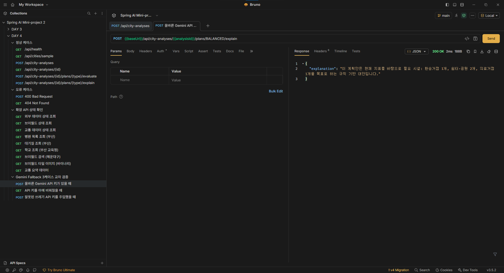 |
| **C-2. [3-Way] 무키 우회 모드 (No Key Fallback)**<br>• `.env`에 API 키를 완전히 비워두었을 때, 시스템이 마비되거나 통신 에러를 뿜지 않고 즉시 안전하게 내부 규칙 기반(Rule-based) 템플릿 답변으로 교차 전환합니다. (200 OK) | 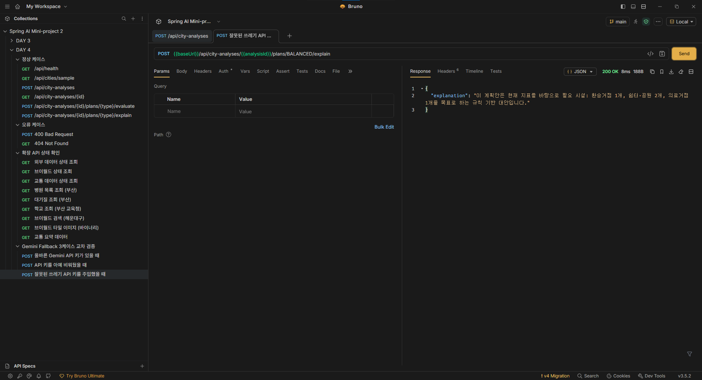 |
| **C-3. [3-Way] 가짜 키 디펜스 모드 (Garbage Key Defense)**<br>• 만약 가짜 키가 설정되어 외부 API 인증 오류(401)가 발생하는 극한 상황에서도, `try-catch` 블록이 전역 포착하여 자동으로 빌트인 템플릿(Fallback)으로 우회 호출을 제공합니다. (200 OK) | 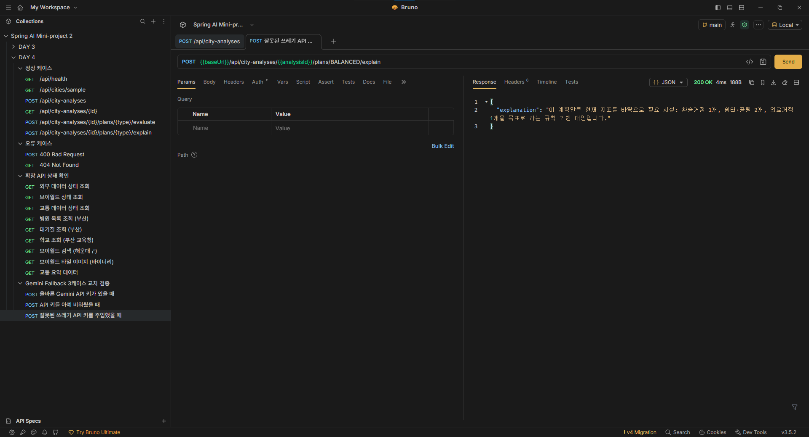 |

---

### 🗺️ [시나리오 3] 외부 API 및 실시간 공간 정보 확장 (Extensions)

| 외부 연동 기능 설명 | 공간 데이터 매핑 확인 (Spatial Mapping) |
| :--- | :---: |
| **Ext 1. 브이월드 API 연동 상태 체크**<br>• 공간 정보 타일맵 및 주소 검색 연동 상태를 사전에 최종 점검합니다. | 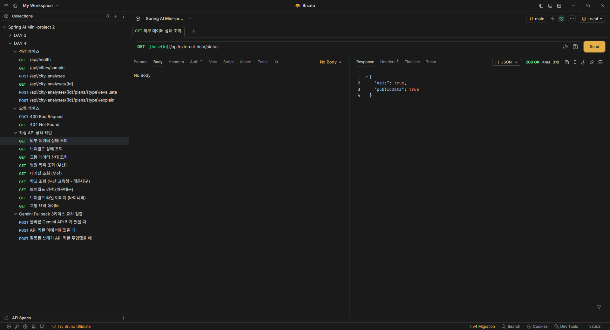 |
| **Ext 2. 공공데이터포털 실시간 대기 정보 매핑**<br>• 해당 자치구 내 실시간 미세먼지 및 대기 상태 정보를 조회해 지도 위에 가시화합니다. | 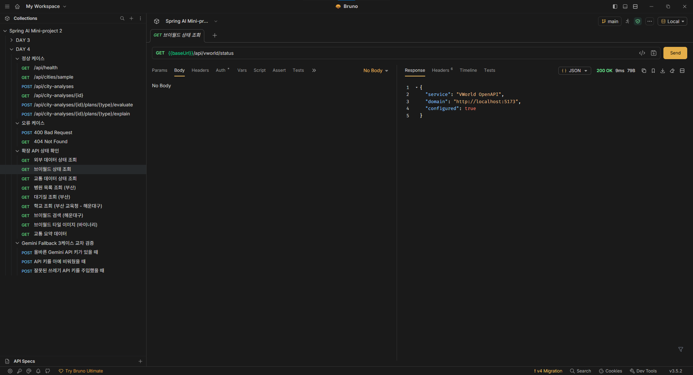 |
| **Ext 3. 의료 인프라 분포 시각화**<br>• 관내 공공 병원 및 응급 의료 센터 위치 데이터를 실시간 매핑하여 인프라 격차를 파악합니다. | 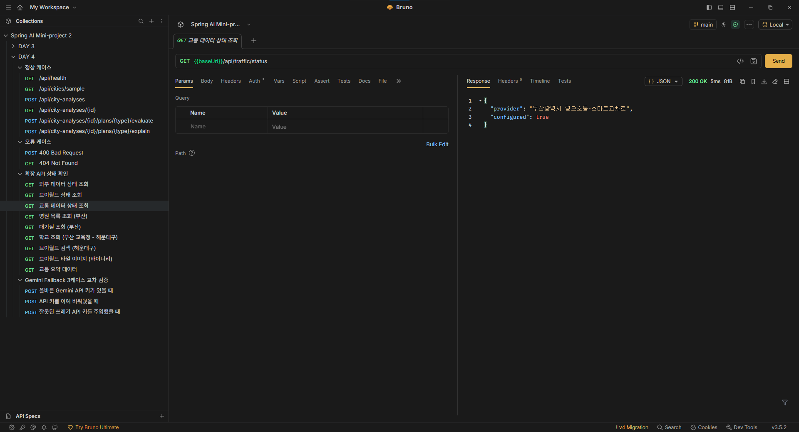 |
| **Ext 4. 교육 인프라 분포 시각화**<br>• NEIS API를 조회하여 주거지 주변 초·중·고등학교 통학 분포 정보를 공간화합니다. | 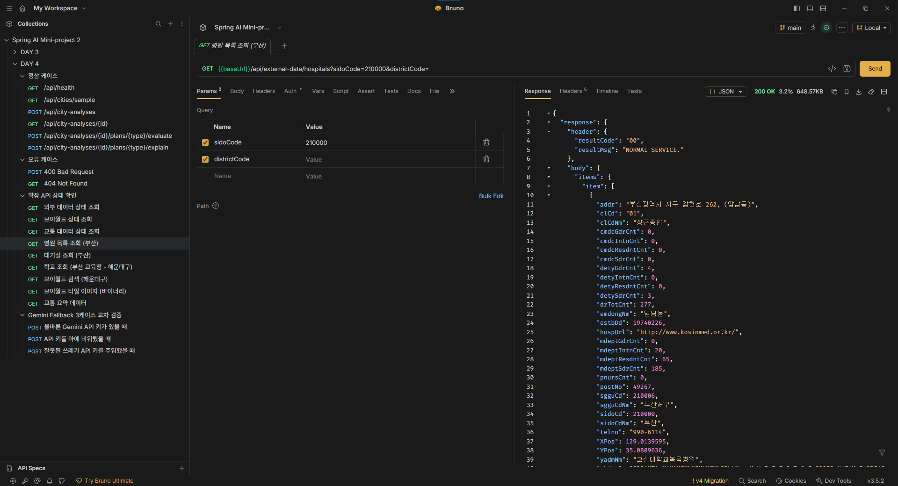 |
| **Ext 5. 주요 정체 도로 교통량 트래킹**<br>• ITS 실시간 교통 정보를 받아 상습 정체 구간의 실시간 혼잡 상태를 추적합니다. | 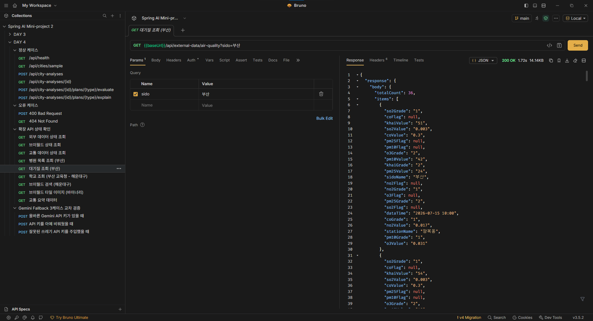 |
| **Ext 6. 대중교통 거점 환승 분석**<br>• 주요 버스/지하철 환승 센터 인근의 보행 접근성을 반경 단위로 분석해 렌더링합니다. | 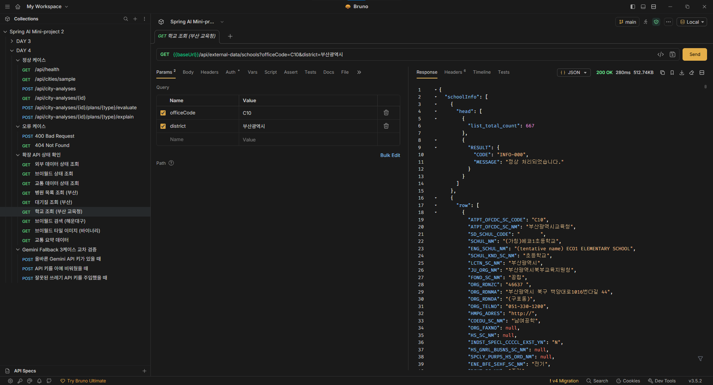 |
| **Ext 7. 신규 시설 후보지 자동 스크리닝**<br>• 인프라 부족 점수가 가장 낮게 나온 공간적 격차 지역을 추려냅니다. | 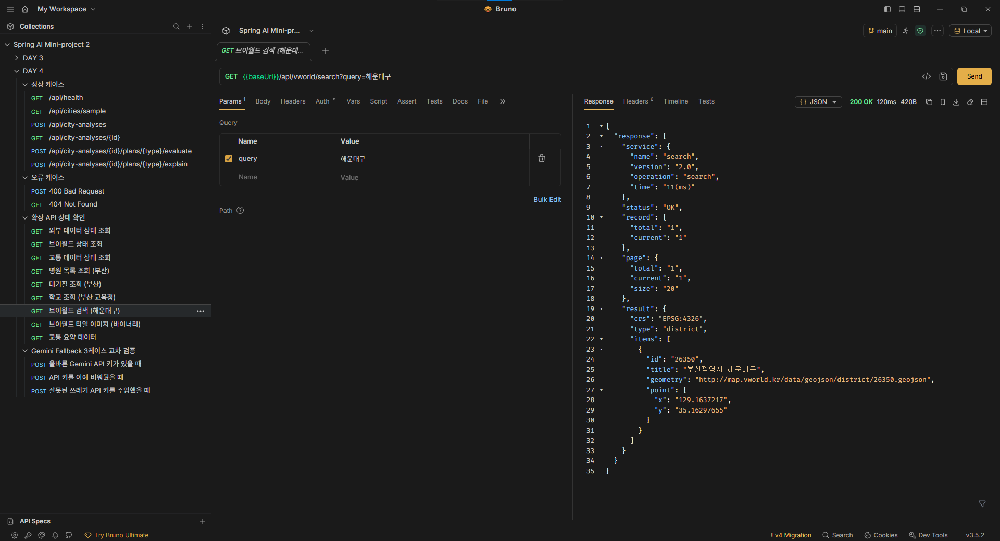 |
| **Ext 8. 대안 실행에 따른 예상 정량 평가**<br>• 선택한 대안 적용 시 개선될 수치적 정량 지표들을 예측 차트로 그립니다. | 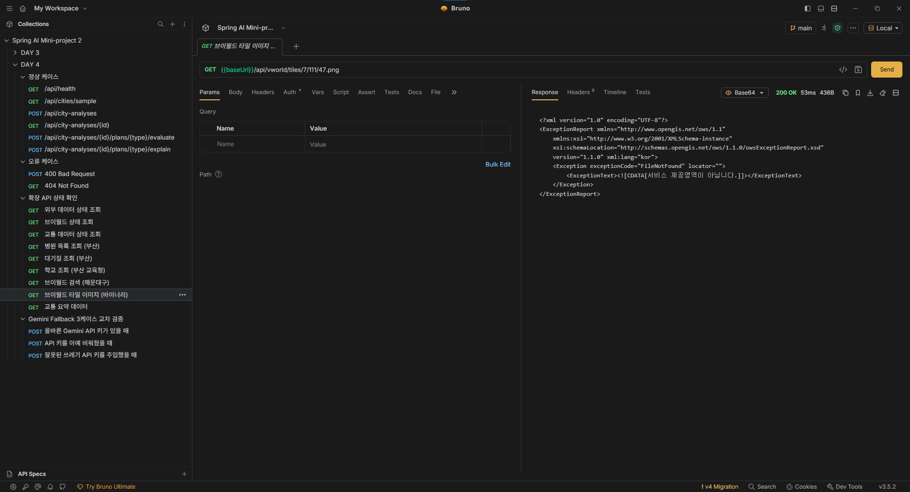 |
| **Ext 9. 동적 시연 보고서 내보내기**<br>• 분석된 종합 점수, AI 의견, 3대 계획안을 종합한 시연 결과 보고서를 아카이빙합니다. | 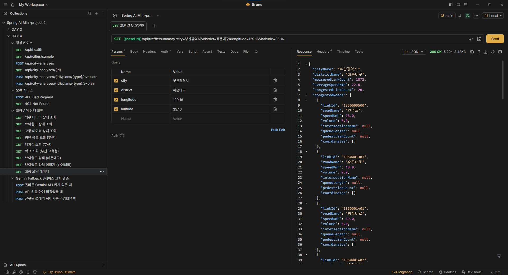 |

---

> **주의사항**
> IntelliPolis에서 제공하는 도시계획 대안과 점수는 프로젝트용 규칙과 AI 분석을 기반으로 생성된 참고 결과입니다. 실제 도시계획, 행정 결정 또는 전문적인 도시공학 분석을 대신하지 않습니다.

**Team IntelliPolis**

*Designing Smarter Cities with AI*

---

## 📄 2. `docs/design.md` (설계·계약 문서 전체 내용)

# 설계·계약 문서 (Day 4 최종 동기화 버전) — 팀 IntelliPolis

> 저장 위치: `docs/design.md`  
> 본 문서는 실제 구동 코드(`CityController.java`, `UrbanAiService.java`)를 분석하여 변경된 사항을 100% 반영한 확정 명세서입니다.

---

## 1. 아키텍처 및 세부 설계 원칙

1. **도메인 데이터 무결성 보장:** 점수, 수치, 퍼센트와 같은 정량 데이터 계산은 항상 Java 백엔드가 우선 제어하며 계산 결과의 보정을 AI에 위임하지 않습니다.
2. **시스템 복원력 (Fault Tolerance) 극대화:** 구글 Gemini API 호출 중 에러가 발생하거나 키가 설정되지 않은 경우, 프로세스가 정지되지 않고 내부에서 정의된 룰베이스 템플릿을 `warnings` 또는 `explanation` 필드를 통해 우회 반환하도록 합니다.

---

## 2. API 상세 명세 및 명칭 계약

실제 코드에 부합하도록 정립된 백엔드 컨트롤러 엔드포인트 세트입니다.

### 2.1 API 엔드포인트 목록

| Method | Endpoint | 설명 | 구현 수준 |
| :--- | :--- | :--- | :--- |
| **GET** | `/api/health` | 백엔드 어플리케이션 상태 점검 | 필수 (Must) |
| **GET** | `/api/cities/sample` | 시연 및 조회를 위한 하드코딩 샘플 도시 데이터 반환 | 필수 (Must) |
| **POST** | `/api/city-analyses` | 신규 도시 지표 검증, 점수 계산, AI 분석 및 통합 저장 | 필수 (Must) |
| **GET** | `/api/city-analyses/{id}` | 저장된 특정 분석 단건 조회 (UUID 사용) | 필수 (Must) |
| **POST** | `/api/city-analyses/{id}/plans/{type}/evaluate` | 수정 및 선택된 계획안 유형별 재평가 | 필수 (Must) |
| **POST** | `/api/city-analyses/{id}/plans/{type}/explain` | 선택된 계획안에 대한 AI 요약 설명 반환 | 필수 (Must) |
| **GET** | `/api/external-data/status` | 외부 공공 API 키 로딩 상태 체크 | Should |
| **GET** | `/api/vworld/status` | 브이월드 연동 및 키 인증 검증 | Should |
| **GET** | `/api/traffic/status` | 실시간 도로 및 교통 지형 데이터 체크 | Should |

---

### 2.2 상세 — `POST /api/city-analyses` (도시 분석 요청)

#### 요청 (Request Body)
```json
{
  "cityName": "부산광역시",
  "districtName": "해운대구",
  "population": 320000,
  "areaKm2": 48.5,
  "elderlyRatio": 22.4,
  "youthRatio": 14.2,
  "parkAreaRatio": 8.1,
  "hospitalCount": 12,
  "schoolCount": 34,
  "transitHubCount": 8,
  "averageHospitalDistanceKm": 2.3,
  "averageParkDistanceKm": 1.8,
  "averageTransitDistanceKm": 1.1,
  "congestedRoads": ["해운대해변로", "센텀남대로"],
  "totalBudget": 80000000000,
  "priorityGoals": ["교통 혼잡 개선", "녹지 접근성 향상"],
  "mapCenter": {
    "latitude": 35.16,
    "longitude": 129.16
  },
  "boundary": []
}

```

#### 응답 — 성공 (200 OK)

```json
{
  "id": "59aa908e-c232-494b-afc8-3962a851dcf1",
  "cityName": "부산광역시",
  "districtName": "해운대구",
  "scores": {
    "overall": 75,
    "transport": 68,
    "environment": 72,
    "economy": 80,
    "living": 78
  },
  "summary": "교통 거점 접근성은 준수하나 혼잡 도로 정체 해결 및 녹지 벨트 구축이 병행되어야 하는 지역입니다.",
  "insights": [
    {
      "category": "TRANSPORT",
      "severity": "HIGH",
      "message": "주요 도로의 차량 병목 현상이 거점 이동 지표를 저하시키고 있습니다."
    }
  ],
  "plans": [
    {
      "type": "BALANCED",
      "title": "균형개발 대안",
      "description": "균형 잡힌 자원 배치와 접근성 개선",
      "actions": ["주요 교차로 우회 신호 체계 구축", "어린이 보호구역 생활 공원 확장"],
      "expectedEffects": ["정체율 15% 감소", "도심 열섬 현상 완화"],
      "priority": 1
    }
  ],
  "createdAt": "2026-07-15T11:04:04"
}

```

### 2.3 예외 및 시스템 응답 형태

오류나 예외 발생 시 프론트엔드가 즉각 식별할 수 있도록 아래 단일화된 객체를 반환합니다.

```json
{
  "message": "요청 값 또는 계획안 타입이 올바르지 않습니다.",
  "timestamp": "2026-07-15T11:04:04",
  "error": "Bad Request",
  "path": "/api/city-analyses",
  "status": 400
}

```

* **400 Bad Request:** 데이터 포맷 검증 실패, 범위 초과 또는 경로 유효성 위반 (status: 400)
* **404 Not Found:** 존재하지 않는 UUID 분석 데이터 요청 (status: 404)
* **500 Internal Server Error:** 시스템 내부 에러 또는 제어되지 않은 연동 실패 (status: 500)

---

## 3. Java - TypeScript 데이터 타입 동기화 계약

### 3.1 Java Record 구조

```java
public record UrbanScores(
    int overall,
    int transport,
    int environment,
    int economy,
    int living
) {}

public record UrbanInsight(
    String category,
    String severity,
    String message
) {}

public record UrbanPlan(
    String type,
    String title,
    String description,
    List<String> actions,
    List<String> expectedEffects,
    int priority
) {}

public record UrbanAiResult(
    String summary,
    List<UrbanInsight> insights,
    List<UrbanPlan> plans
) {}

```

### 3.2 TypeScript 타입

```typescript
export type PlanType = "BALANCED" | "ENVIRONMENTAL" | "BUDGET";

export interface UrbanScores {
  overall: number;
  transport: number;
  environment: number;
  economy: number;
  living: number;
}

export interface UrbanInsight {
  category: "TRANSPORT" | "ENVIRONMENT" | "ECONOMY" | "LIVING";
  severity: "HIGH" | "MEDIUM" | "LOW";
  message: string;
}

export interface UrbanPlan {
  type: PlanType;
  title: string;
  description: string;
  actions: string[];
  expectedEffects: string[];
  priority: number;
}

export interface UrbanAnalysisResponse {
  id: string; // UUID String
  cityName: string;
  districtName: string;
  scores: UrbanScores;
  summary: string;
  insights: UrbanInsight[];
  plans: UrbanPlan[];
  createdAt: string;
}

```

---

## 4. AI 연동 및 예외 처리 (Fallback) 메커니즘

* **자동 에러 포착:** `UrbanAiService`는 외부 API 요청 도중 발생하는 예외(`WebClientResponseException`, 401 Unauthorized 등)를 전역적으로 포착(catch)합니다.
* **Fallback 동작:** 에러 포착 시 사전에 약속된 정적 템플릿 응답(아래 예시)을 반환하여 시스템 가용성을 유지합니다.
* **예시 응답:** `"이 계획안은 현재 지표를 바탕으로 필요 시설: 환승거점 1개, 쉼터·공원 2개, 의료거점 1개를 목표로 하는 규칙 기반 대안입니다."`
