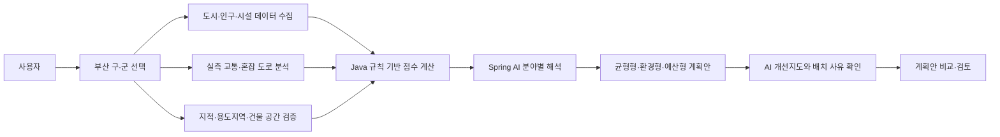

# Day 4 통합 진행사항 보고서

- 프로젝트: IntelliPolis AI Urban Planner
- 작성일: 2026년 7월 15일
- 분석 범위: 부산광역시 16개 구·군
- 서비스 성격: 실제 행정 결정을 대신하지 않는 도시계획 대안 비교·검토용 의사결정 지원 플랫폼

## 오늘 구현한 사용자 흐름

사용자가 부산광역시의 구·군을 선택하면 도시·인구·시설·교통·공간 데이터를 통합 분석하고, 실제 구 경계 안에 필요한 시설 후보와 혼잡 도로별 개선 수단 및 근거를 지도와 계획안으로 확인한다.

### Use Case 다이어그램

### 통합 사용자 흐름

1. 사용자가 부산광역시 16개 구·군 중 분석 지역을 선택한다.
2. 프론트엔드가 구 경계, 도시요약, 교통, 공간 후보 API를 호출하고 진행률을 표시한다.
3. 백엔드가 인구·공원·학교·버스정류장·병원·예산과 실측 교통을 집계한다.
4. 연속지적도, 도시계획시설, 용도지역, GIS 건물통합정보를 결합해 후보 필지를 검증한다.
5. Java가 현재 도시 점수와 필요한 시설 수량을 계산한다.
6. Spring AI가 교통·환경·경제·생활 관점에서 결과를 해석하며, 실패한 분야만 규칙 기반 설명으로 대체한다.
7. 지도에 구 전체 경계, 시설 후보, 실제 혼잡 도로와 개선 수단을 표시한다.
8. 사용자는 균형형·환경 중심형·예산 효율형 계획안을 비교한다.

## 현재 통합 진행 상태

### 역할·도메인별 상태

| 도메인 | 진행 상태 | 통합 내용 |
| --- | --- | --- |
| 프론트엔드 | 완료 | React 화면에서 구 선택, 분석 진행률, 계획안 비교, 데이터 근거와 한계를 표시한다. |
| 화면 UI·UX | 완료 | 팀원의 컴포넌트 배치와 CSS를 우선 반영하고, 현재 지도 대신 AI 개선지도에 집중하도록 통합했다. |
| 지도 | 완료 | MapLibre로 구 전체 외곽 경계, 시설 후보, 혼잡 도로, 도로 개선 이름표와 2D/3D 전환을 제공한다. |
| 백엔드 | 완료 | Spring Boot API가 도시요약, 교통, 공간 후보, 점수, 계획안 생성과 재평가를 담당한다. |
| Spring AI | 완료 | Gemini 3.1 Flash-Lite를 분야별 프롬프트로 호출하고 장애 시 분야별 fallback을 적용한다. |
| 데이터 통합 | 완료 | 부산 인구·공원·학교·버스·병원·상권·예산·교통·지적·용도지역·건물 데이터를 연결했다. |
| 후보지 검증 | 완료 | GIS 건물통합정보 303,337개 필지를 결합해 기존 건물이 없는 필지만 후보로 사용한다. |
| 도로 개선 | 완료 | 실측 혼잡 링크에 신호, 차로, 대중교통, 보행, 수요관리 수단과 관측 근거를 연결한다. |
| DB·캐시 | 부분 완료 | MVP 분석 결과는 메모리에 저장하고, 무거운 공간·교통 전처리 결과는 로컬 디스크 캐시로 재사용한다. |
| 오류 처리 | 완료 | 입력 검증, 404, 외부 API 실패, Gemini 실패를 한국어 메시지와 fallback으로 처리한다. |
| 테스트 | 완료 | 백엔드 전체 38개 테스트와 프론트엔드 TypeScript·Vite 프로덕션 빌드를 통과했다. |

### 오늘 통합한 핵심 변경

- `main`의 최신 UI·README 변경을 기능 브랜치에 병합했다.
- 강서구 현재 지도는 제거하고 AI 개선지도 하나에 분석 결과를 집중시켰다.
- 지도 위 혼잡 도로에 `가락대로 개선 검토`와 같은 도로 이름표가 표시되도록 복구했다.
- `분석 데이터 적용 근거`와 실제 `데이터 한계`를 화면에서 분리했다.
- 시설을 종류별 한 개씩 강제하지 않고 부족한 유형과 수량만 제안하도록 수정했다.
- 필지 면적, 법정동 인구, 반경 약 1km 활동점, 시설 유형별 적합도를 반영해 후보 배치를 개선했다.
- 건강보험심사평가원 병원 API의 전체 페이지와 좌표를 수집해 생활권 후보의 의료 접근거리를 계산했다.
- 부산 GIS 건물통합정보를 연결해 기존 건물이 있는 필지를 신규 시설 후보에서 배제했다.
- 부산 16개 구·군 전체 후보 분석을 실행하고, 각 지역의 적합 필지 중 수요와 공간 분산을 고려한 최대 20개만 지도 후보로 전달한다.

### 스크린샷

#### 1. 정상 분석 흐름

#### 2. AI 분석과 계획안

#### 3. 실측 교통과 혼잡 도로

#### 4. 신규 시설 후보지 검증

## 현재 맞고 있는 가장 큰 문제

### 문제: 데이터 기반 후보와 실제 사업 가능성 사이의 차이

현재 시스템은 부산 전체 구 경계 안에서 인구, 활동점, 공원·병원·버스 접근성, 용도지역, 도시계획시설, 기존 건물 여부를 검토한다. 따라서 임의 좌표나 산지 한곳에 시설을 몰아 배치하던 초기 문제는 크게 개선됐다.

그러나 실제 도시계획 사업은 다음 정보까지 검토해야 확정할 수 있다.

- 토지 소유권과 공공·민간 소유 구분
- 개별공시지가와 토지보상비
- 도로·보행 네트워크 기반 실제 이동시간
- 경사도, 재해 위험, 환경·문화재 규제
- 시설별 법정 입지 기준과 인허가 조건
- 현장 조사, 주민 수요조사, 교통 시뮬레이션

### 현재 대응

- 결과를 확정 입지가 아닌 `우선 검토 후보지`로 명시한다.
- 시설별 수요가 기준을 넘지 않으면 시설을 제안하지 않는다.
- 후보지마다 사용한 인구, 활동점, 필지 면적과 배치 사유를 사람이 읽기 쉬운 문장으로 제공한다.
- 실제 건물이 있는 필지는 후보에서 제외한다.
- 도로 확장·신설을 기본안으로 강제하지 않고, 신호·차로 운영·대중교통·보행 개선을 우선 제시한다.
- 도로 개선안에 실측 속도, 교통량, 대기행렬, 보행자 수와 근거 신뢰도를 표시한다.
- API나 AI가 실패해도 분석 전체가 중단되지 않도록 미수집 안내와 fallback을 제공한다.

## 앞으로 남은 할 일들

1. 팀원별 최종 브랜치를 `main`에 병합하고 통합 충돌을 확인한다.
2. 부산 여러 구에서 시설 수량, 분산 배치, 산지·산업지역 오추천 여부를 교차 검증한다.
3. 정상 API, API 부분 실패, Gemini fallback의 실제 화면을 각각 최종 시연한다.
4. 토지 소유·공시지가·보행 네트워크 데이터를 확보할 수 있을 때 사업 가능성 점수에 추가한다.
5. 현재 메모리 저장소를 MySQL로 교체해 분석 이력과 계획안을 영구 저장한다.
6. 배포 환경의 API 키, CORS, 대용량 원본 데이터 경로와 캐시 초기화 절차를 정리한다.
7. 발표용 시나리오에 맞춰 분석 전·진행 중·결과·오류 화면을 다시 캡처한다.
8. 최종 병합 후 백엔드 전체 테스트와 프론트 프로덕션 빌드를 다시 실행한다.

## 통합 검증 결과

- 백엔드 상태: `GET /api/health` → `UP`
- 부산 16개 구·군 도시요약·경계·교통·후보지·최종 계획안 API 전수 성공
- 모든 구·군에서 계획안 3개 생성
- 후보지 면적 500㎡ 미만·인구 0명·필지번호 중복: 0건
- GIS 건물 필지 캐시: 303,337개, 약 6.37MB
- 백엔드: 오류 처리 회귀 테스트를 포함한 40개 테스트 통과
- 프론트엔드: TypeScript 검사 및 Vite 프로덕션 빌드 통과
- 작업 브랜치: `18-검증-백엔드`

### 부산 16개 구·군 전수 결과

| 지역 | 인구 | 병원 | 적합 필지 | 지도 후보 | 교통 관측 링크 | 계획안 |
| --- | ---: | ---: | ---: | ---: | ---: | ---: |
| 강서구 | 153,555 | 129 | 18,223 | 20 | 2,327 | 3 |
| 금정구 | 205,672 | 366 | 2,631 | 20 | 720 | 3 |
| 기장군 | 175,262 | 209 | 19,032 | 20 | 1,760 | 3 |
| 남구 | 254,413 | 411 | 743 | 20 | 507 | 3 |
| 동구 | 83,354 | 158 | 195 | 19 | 298 | 3 |
| 동래구 | 271,097 | 533 | 576 | 20 | 552 | 3 |
| 부산진구 | 364,912 | 869 | 645 | 20 | 720 | 3 |
| 북구 | 260,736 | 388 | 1,066 | 20 | 538 | 3 |
| 사상구 | 192,475 | 247 | 661 | 20 | 629 | 3 |
| 사하구 | 282,159 | 438 | 1,324 | 20 | 715 | 3 |
| 서구 | 101,216 | 139 | 577 | 20 | 242 | 3 |
| 수영구 | 168,440 | 337 | 346 | 20 | 307 | 3 |
| 연제구 | 211,464 | 401 | 286 | 20 | 381 | 3 |
| 영도구 | 100,570 | 135 | 511 | 20 | 254 | 3 |
| 중구 | 36,306 | 139 | 72 | 8 | 108 | 3 |
| 해운대구 | 370,739 | 710 | 2,045 | 20 | 1,196 | 3 |

동구와 중구는 후보 간 최소 분산거리 조건을 충족한 위치만 사용해 각각 19개와 8개를 반환했다. 수량을 맞추기 위해 가까운 필지를 억지로 추가하지 않았다. 영도구는 스마트교차로 이름·좌표가 확실히 일치하지 않아 해당 관측값을 임의 결합하지 않았다는 안전 경고가 추가됐으며, 국가 ITS 링크 분석과 계획안 생성은 정상 완료됐다.

최초 전수 실행은 구별 공간 캐시 생성과 외부 API 호출을 포함해 약 10분 25초가 걸렸다. 캐시 생성 후 도시요약과 공간 후보 재조회는 구별 약 0.002~0.086초였다.

### 전수 검증 중 발견하고 해결한 오류

- 존재하지 않는 API 경로가 500으로 처리되던 문제를 404 응답으로 수정했다.
- `@NotBlank` 쿼리 파라미터에 빈 문자열을 전달했을 때 500이 발생하던 문제를 400 응답으로 수정했다.
- 두 사례를 자동 회귀 테스트로 추가했다.

---

IntelliPolis의 결과는 실제 행정 결정이나 확정 사업안이 아니라, 객관적 데이터와 AI 해석을 함께 제공하여 도시계획 대안을 비교·검토하도록 돕는 시뮬레이션 결과이다.
