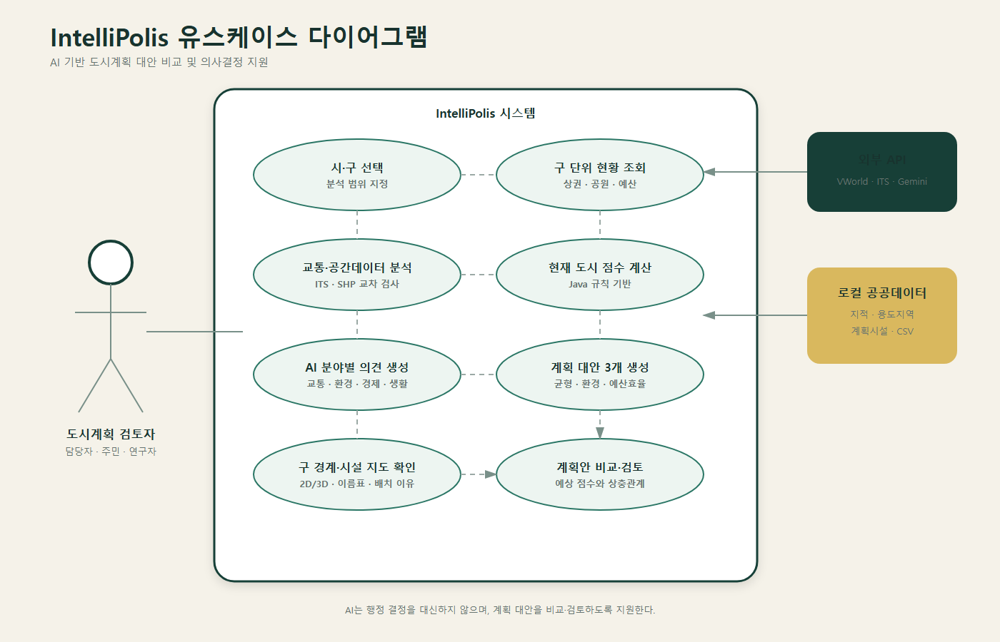

# Day 4 통합 진행사항 보고서

- 프로젝트: IntelliPolis AI Urban Planner
- 작성일: 2026년 7월 15일
- 범위: 부산광역시 16개 구·군

> IntelliPolis는 실제 행정 결정을 대신하지 않고, 도시계획 대안을 비교·검토하도록 돕는 의사결정 지원 서비스입니다.

## 오늘 구현한 사용자 흐름

사용자가 부산의 구·군을 선택하면 인구·시설·교통·공간 데이터를 분석하여 필요한 시설과 혼잡 도로 개선안을 지도와 계획안으로 보여줍니다.

1. 부산 구·군 선택
2. 도시·교통·공간 데이터 수집
3. Java 규칙 기반 점수 및 필요 시설 계산
4. Spring AI 분야별 해석과 계획안 생성
5. AI 개선지도에서 시설·도로·배치 사유 확인
6. 균형형·환경형·예산형 계획안 비교

## 현재 통합 진행 상태

| 영역 | 상태 | 주요 내용 |
| --- | --- | --- |
| 프론트엔드·UI | 완료 | 구 선택, 분석 진행률, 계획안 비교, 근거와 한계 표시 |
| 지도 | 완료 | 구 경계, 시설 후보, 혼잡 도로, 개선 이름표, 2D/3D 표시 |
| 백엔드 | 완료 | 도시요약, 교통, 후보지, 점수, 계획안 API 통합 |
| Spring AI | 완료 | 교통·환경·경제·생활 분석, 실패 분야 fallback 적용 |
| 데이터 | 완료 | 부산 인구·시설·병원·교통·지적·용도지역·건물 연결 |
| 저장소 | 부분 완료 | 분석 결과는 메모리, 대용량 전처리 결과는 디스크 캐시 사용 |
| 오류 처리 | 완료 | 입력 오류, 404, 외부 API·AI 실패를 한국어로 안내 |

### 오늘의 핵심 변경

- 팀원의 UI·CSS와 현재 분석 기능을 통합했습니다.
- 시설을 종류별 한 개씩 강제하지 않고 필요한 유형과 수량만 제안합니다.
- 필지 면적, 법정동 인구, 생활 활동점과 시설별 적합도를 반영했습니다.
- GIS 건물정보를 결합해 기존 건물이 없는 필지만 후보로 사용합니다.
- 실제 혼잡 도로에 신호·차로·대중교통·보행 개선 수단과 관측 근거를 연결했습니다.
- 데이터 적용 근거와 실제 데이터 한계를 화면에서 분리했습니다.

### 화면

## 현재 맞고 있는 가장 큰 문제

### 데이터 후보와 실제 사업 가능성의 차이

현재 후보지는 인구, 시설 접근성, 용도지역, 도시계획시설, 기존 건물 여부를 반영합니다. 그러나 실제 사업 확정에는 토지 소유권, 공시지가·보상비, 보행 이동시간, 경사·재해·환경 규제, 인허가와 현장조사가 추가로 필요합니다.

### 현재 대응

- 결과를 확정 입지가 아닌 `우선 검토 후보지`로 안내합니다.
- 필요 기준을 넘지 않으면 시설을 제안하지 않습니다.
- 후보마다 인구·활동점·필지 면적과 배치 이유를 제공합니다.
- 도로 확장보다 신호·차로·대중교통·보행 개선을 우선 검토합니다.
- 불확실한 스마트교차로 값은 다른 도로에 임의로 연결하지 않습니다.

## 부산 전체 통합 검증

- 부산 16개 구·군의 도시요약·경계·교통·후보지·계획안 API가 모두 성공했습니다.
- 모든 구·군에서 계획안 3개가 생성됐습니다.
- 500㎡ 미만 후보, 인구 0명 후보, 중복 필지는 없었습니다.
- GIS 건물 필지 303,337개를 반영했습니다.
- 적합 필지는 중구 72개부터 기장군 19,032개까지 지역 특성에 따라 다르게 확인됐습니다.
- 지도 후보는 최대 20개이며, 동구는 19개, 중구는 분산 조건을 충족한 8개만 반환했습니다.
- 최초 전체 검증은 캐시 생성과 외부 API 호출을 포함해 약 10분 25초, 캐시 후 도시요약·후보 조회는 구별 약 0.002~0.086초였습니다.
- 백엔드 40개 테스트와 프론트엔드 프로덕션 빌드를 통과했습니다.

### 검증 중 해결한 오류

- 존재하지 않는 API 경로: `500 → 404`
- 빈 쿼리 파라미터: `500 → 400`
- 두 사례를 자동 회귀 테스트에 추가했습니다.

## 앞으로 남은 할 일

1. 팀원 최종 브랜치를 `main`에 병합하고 통합 테스트를 다시 실행합니다.
2. 정상·외부 API 실패·Gemini fallback 화면을 최종 시연합니다.
3. 발표용 분석 전·진행 중·결과·오류 화면을 다시 캡처합니다.
4. 배포 환경의 API 키, CORS, 원본 데이터 경로와 캐시 절차를 정리합니다.
5. 추후 토지 소유·공시지가·보행 네트워크와 영구 DB를 연동합니다.
